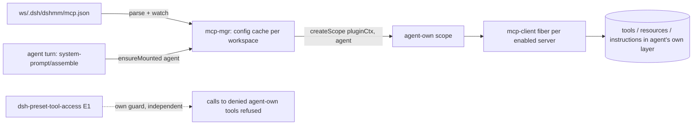
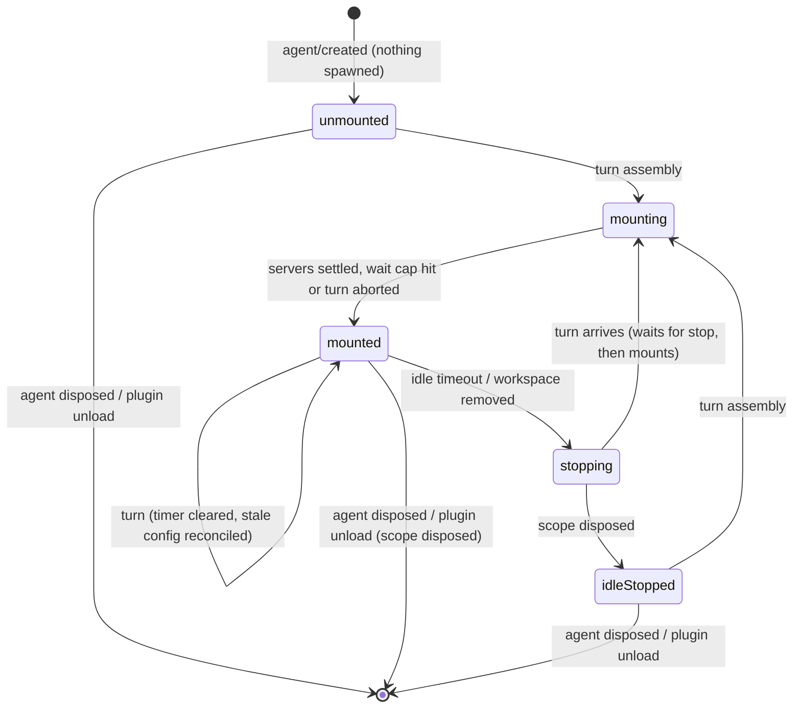

# 1. Agent-scoped lazy workspace MCP mounts

## Status

* Status: **accepted** (2026-10-07; proposed in ea6ceb3). **Amended 2026-10-08**: the `mcp-mgr/agent-servers` waterfall (M1) and the dsh-preset-tool-access listener with `disabledServers` (E2) are dropped; the wait cap covers every mount wait and honours abort; the headless rule is tightened.
* Host baseline: DSH 0.2.0-rc.2 (`deepseek-harness` tag `dsh-v0.2.0-rc.2`; paths below are under `packages/`)

## Context

Today the host plugin reads `<ws>/.dsh/dshmm/mcp.json` for **every** registered workspace (`src/discovery.ts:39-46`) and mounts one `@deepseek-ai/dsh-mcp-client` per server on its app-level context (`src/index.ts:95`). mcp-client registers into `scopeOf(ctx) ?? ctx.root` (`mcp/mcp-client/src/index.ts:162-176`), so every workspace's tools are global and visible to every session, agent and preset. The only narrowing is a host-wide in-memory `strictMode` / `activeWorkspace` (`src/index.ts:82-84, 408`), pushed by the browser from `localStorage` `dsh.mcpMgr.strictMode`. It is lost on host restart or origin change, and it is wrong whenever two workspaces are active at the same time.

Host facts this design depends on:

* An agent's scope is `createScope(loopCtx, agent)` (`core/agent-loop/src/agent.ts:130`). Its only parent is the **preset generation** scope, which the preset registry binds privately and which every agent of that preset shares across workspaces (`preset/agent-preset-registry/src/index.ts:226-250, 273-284`). `bindScopeParent` refuses a second binding (`core/scope/src/index.ts:72-82`).
* Per-agent mounting has a precedent: `createScope(ownCtx, agent)` + `ctx.plugin(McpClient, …)` with `cwd` taken from `agent.session.header.cwd` (`experimental/browser-use-runtime/src/mcp.ts:130-165`).
* The workspace registry assigns a session to a workspace only when `realpath(header.cwd)` **equals** the workspace path (`workspace/workspace/src/index.ts:804-822, 839-845`).
* Agents are materialised just by opening a session in the GUI. Main agents live until host shutdown. Subagents are disposed when they finish and inherit `cwd` from their parent.
* mcp-client also publishes per-scope resources and instructions (`mcp/mcp-client/src/server-context.ts:28-39`, `mcp/mcp-resources/src/index.ts:80-126`).

## Decision drivers

* DR1: an agent sees only the servers of its own session's workspace.
* DR2: no MCP processes for sessions that are only open, not used.
* DR3: **zero coupling** between dsh-mcp-mgr and dsh-preset-tool-access: no shared event names, contracts or package dependencies. dsh-mcp-mgr has no preset logic.
* DR4: a turn never fails because an MCP server fails.
* DR5: no host-wide UI state and no hand-edited config.

## Decision

1. **Per-agent, lazy mounts.** On an agent's first turn, dsh-mcp-mgr resolves the agent's workspace and mounts **all** of that workspace's enabled, non-conflict servers into `createScope(pluginCtx, agent)`. The scope is released when the agent is disposed (an `agent.ctx.effect` cleanup) or when the plugin unloads. The same server may run once per agent.
2. **Workspace resolution.**
   * Registry present: `realpath(agent.session.header.cwd)` must exactly equal a registered workspace.
   * Registry absent (headless): the agent gets the host cwd's servers only if `realpath.native(header.cwd)` equals `realpath.native(process.cwd())`; otherwise none.
   * Web profile whose registry is not yet available: treated as "no workspace" (nothing mounted, re-checked next turn).
3. **Subagents** follow the same rule independently: their inherited `cwd` selects the same workspace, and they mount on their own first turn.
4. **Idle stop.** No turn for `agentIdleTimeoutMs` (default 15 min, configurable) disposes the mount. The next turn remounts it.
5. **Mount wait cap.** All waiting for an agent's mounts within one agent activity (running → idle), including any re-assembly pass, shares one budget of `agentMountWaitMs` (default 30 s, configurable) and ends at once when the turn's abort `signal` fires. Assembly then continues without the missing servers; the mount carries on in the background.
6. **Name conflict.** A workspace server whose name equals a profile-level (global) mcp-client server is marked `conflict`: never mounted for any agent, shown as `conflict` in the UI. Names only need to be unique within one mcp.json otherwise.
7. **Strict mode and `activeWorkspace` are removed** from the host, the Remote API, the UI and localStorage.
8. **Per-preset blocking = E1 only**, owned entirely by dsh-preset-tool-access (see D1). dsh-mcp-mgr emits no event and reads no policy for it.

## Why E1 is required

With host 0.2.0-rc.2, agent-own registrations cannot be hidden by `restrict`:

| # | Evidence | Consequence |
|---|---|---|
| 1 | `view()` applies restrictions only to inherited names; own registrations are added afterwards (`core/tools/src/index.ts:1184-1209`). | A `deny` cannot hide an agent-own tool. |
| 2 | `restrict()` requires every name to be in `restrictableNames` (inherited only), otherwise throws (`index.ts:1114-1117`). | A deny naming an agent-own tool throws. |
| 3 | Filters are exact sets, no patterns (`index.ts:700-711, 757-763`). | `mcp__serena__*` cannot be expressed. |
| 4 | No intermediate scope between agent and preset generation (see Context). | No per-workspace ancestor to inherit from. |
| 5 | dsh-preset-tool-access builds its deny list from `agent.ctx.tools.schemas(agent)`, which includes own names (`lib/host-seams.js:213-223`, `lib/domain/tool-access.js:113-119`), and disposes the old restriction **before** `restrict` (`lib/reconciler.js:25-35`). | After a lazy mount, `restrict` throws and the agent loses **all** denials. |

So D2 without E1 is a security regression. E1 cannot hide agent-own tools on 0.2.0; it can only refuse their calls.

## Lifecycle

| Event | Behaviour |
|---|---|
| Trigger seam | A `system-prompt/assemble` listener (`core/system-prompt/src/index.ts:625-628`), registered with `prepend`, acting only when the context carries `agent` and `signal` (a turn's assembly, `core/agent/src/dispatch.ts:174-176`). Tools are frozen at assembly, before `agent/pre-step` (`core/agent-loop/src/agent.ts:272-285`). It awaits the mount (capped, abortable); if registrations changed it re-runs `assemble(context)` (the nested call passes through, still within the same budget), else calls `next()`. A mount may be started early on `agent/status` = running. |
| Concurrency | One promise chain per agent; racing assemblies share the in-flight mount; stop and mount are serialised. Servers of one agent start in parallel. |
| Idle | `agent/status` idle starts the timer, running clears it. A mount finishing while idle starts it too. Never stops mid-turn. |
| Config change (watch or Remote write) | Removed/disabled server: disposed now on every agent of that workspace. Added/changed: reconciled at the agent's next turn. |
| Workspace removed | All mounts of agents in that workspace are disposed. |
| No matching workspace / no `cwd` / registry not yet available | Nothing mounted, no error; re-checked each turn. |
| Agent disposed | `agent.ctx.effect` cleanup disposes the scope. A resumed agent starts unmounted. |
| Plugin unload | Plugin ctx owns all agent scopes; everything stops. |

Resources and instructions follow automatically: the mcp-client fiber lives in the agent's scope, so `mcpResources.register` and `systemPrompt.section` (`mcp:<server>`) are agent-scoped and released with the mount.

## Failure handling

* A connect failure never fails the turn. Agent mounts run mcp-client with `failOnStartupError: true` (`src/parse.ts`): a failed first connect or tool sync rejects the fiber after it unloaded (`mcp/mcp-client/src/index.ts` apply; Cordis `Fiber.await` rethrows), so no tools and no `serverName` reservation remain.
* The failed mount is recorded as that row's `lastError` (logged once per distinct error), dropped without a re-assembly, and retried at the agent's next turn. A server still connecting when the wait ends joins from a later step.
* After a successful start, a lost connection uses mcp-client's default reconnect.
* After a failed remount the model may lose tools its history references ("unknown tool"); the tool header change starts a new prompt-cache series.

## UI and Remote changes

* Remove `setStrictMode`, `setActiveWorkspace`, snapshot fields `strictMode` / `activeWorkspace`, the checkbox, locale strings, the `dsh.mcpMgr.strictMode` replay and the active-workspace push (`dsh-mcp-mgr-ui/src/client/index.ts:72-122`). Regenerate the Typert codec and UI bundle (see NOTES.md).
* Rows stay keyed by `workspace#server` with config status `configured` / `disabled` / `conflict` / `error`, plus `liveAgents` (agents with a mount), `connectedAgents` (agents whose view contains `mcp__<server>__*`) and `lastError`. `conflict` rows name the clashing profile-level server.
* The probe moves from the app-ctx `serverHasTools` (`src/index.ts:110, 413-419, 475-487`) to per-agent `tools.schemas(agent)`.
* An idle workspace reads as "configured, not running".

## Configuration

| Key | Default | Note |
|---|---|---|
| `agentIdleTimeoutMs` | `900000` (15 min) | min 60000 |
| `agentMountWaitMs` | `30000` (30 s) | one budget per agent activity (running → idle) for all mount waits; abort ends it early |
| `rescanIntervalMs` | unchanged | still discovers workspaces and config |

## Consequences and risks

* **Blocked presets (e.g. orchestrator):** workspace MCP tools are visible to the model and their processes start; calls to tools named in the preset's deny list are refused by E1's guard. Hiding them needs H1.
* **Release order (compatibility, not coupling):** D2 must not ship before a dsh-preset-tool-access release with E1. With an older one, the first lazy mount makes its `restrict` throw and wipes all of that agent's denials. README states the minimum version.
* **Process count:** up to (agents with a recent turn) × (enabled servers); there is no per-preset lever. Subagents spawn their own set.
* **First-turn latency:** first turn and the turn after an idle stop wait up to `agentMountWaitMs`.
* **Windows orphans:** teardown kills only the direct child; `cmd /c npx …` wrappers can orphan grandchildren, more often with idle stop. Document launching `node` directly.
* **Allow-lists:** a subagent `toolFilter.allow` does not constrain agent-own tools (same exemption as `restrict`); E1 covers the preset deny case only.
* **Shared server state:** gone; per-agent processes isolate e.g. serena's active project.
* **Open follow-up — preset card discovery (deferred, not solved here):** the dsh-preset-tool-access settings card lists tools from the global registry + preset standing scope, so agent-scoped workspace tools no longer appear there and cannot be toggled. Existing `disabledTools` entries keep working via E1. A generic, coupling-free, no-manual-edit discovery mechanism is needed. Candidate directions, none chosen:
  * the card observes `tools/change` on live agents and persists a catalog of seen `mcp__<server>__*` names;
  * enumerate mcp-client fibers through the cordis plugin registry;
  * a host-level DSH feature / upstream proposal (e.g. a tool catalog that includes agent-own registrations).

## Alternatives considered

* **Mount into the preset generation scope + per-workspace execution guard.** Rejected: tools visible across workspaces; names collide in one layer.
* **Per-workspace intermediate ancestor scope.** Impossible: the agent's parent binding is private and single.
* **Global mount + per-agent `restrict({ deny: other workspaces })`.** No change outside this repo, but neither lazy nor per-agent, and needs globally unique names.
* **M1 waterfall `mcp-mgr/agent-servers` + E2 listener with `disabledServers`** (accepted 2026-10-07, now dropped). Would keep blocked servers unspawned and invisible, but shares an event name and contract between the two plugins and needs a hand-edited server-level policy. Rejected by DR3/DR5.
* **dsh-mcp-mgr reads dsh-preset-tool-access's policy directly.** Rejected: violates DR3.

## Deliverables and order

**D1 — dsh-preset-tool-access** (`D:\source\repos\dsh\dsh-preset-tool-access`), ships first.

* E1: restrict only inherited names (`tools.schemas(scopeParentOf(agent))` ∪ global, `core/scope/src/index.ts:89-91`); deny the agent-own names from the preset's existing per-tool `disabledTools` with an agent-scoped `agent.ctx.tools.guard(...)` (`core/tools/src/index.ts:1126-1142`) checked at call time; install the new restriction before disposing the old one (failure-safe reconcile).
* No M1 listener and no `disabledServers` (remove the E2 part already committed in 1dad4c3).

**D2 — dsh-mcp-mgr**, released only after D1; README states the minimum dsh-preset-tool-access version.

1. Workspace resolution incl. the headless and registry-not-ready rules.
2. Per-agent lazy mount manager (state machine, assembly seam, abortable shared wait cap, idle stop, config propagation, conflict rule, per-agent probe); no M1 emitter.
3. Removal of strict mode / `activeWorkspace` from host, Remote, types, codec, UI; status columns; README updates.

**Later — H1 (deepseek-harness, upstream):** let scoped restrictions cover own or future names, so E1 could hide instead of guard. **Later — card discovery:** see the open follow-up. None in dsh-modes.

## Acceptance criteria

D1 (dsh-preset-tool-access):

1. A policy denying an agent-own tool: calling it is denied, `restrict` does not throw, and all other denials of that agent stay in force (regression test with an agent-own name).
2. A reconcile whose new `restrict` fails leaves the previous restriction in force.
3. A denied agent-own tool registered after the last reconcile (lazy mount) is still refused at call time.
4. The package registers no `mcp-mgr/*` listener and has no server-level policy field.

D2 (dsh-mcp-mgr):

5. Sessions in workspaces A and B: each agent's view contains only its own workspace's `mcp__*` tools; the same server name in A and B mounts in both.
6. Opening a session without sending a message spawns no MCP process.
7. The first model request of the first turn contains the workspace servers' tools. With a server down, the turn proceeds without it after at most `agentMountWaitMs` in total for that activity (running → idle), including a re-assembly pass; the value is configurable.
8. Aborting a turn while it waits for mounts ends the wait at once; the mount continues in the background.
9. After `agentIdleTimeoutMs` (default 15 min, configurable) with no turn, the agent's MCP processes exit; the next turn restores identical tools.
10. A subagent in workspace A mounts A's servers on its first turn; its processes exit when it is disposed.
11. Editing mcp.json: a removed server stops at once on all agents; an added server appears at each agent's next turn.
12. A session whose `cwd` matches no registered workspace gets no workspace tools and no error.
13. Headless (no registry): an agent whose `realpath.native(cwd)` equals `realpath.native(process.cwd())` gets that workspace's servers; any other `cwd` gets none. A web profile whose registry is not yet available mounts nothing and retries at the next turn.
14. All agents of a workspace get the same enabled, non-conflict servers regardless of preset; dsh-mcp-mgr emits no preset-related event.
15. A workspace server named like a profile-level server shows `conflict` and is mounted for no agent.
16. No strict-mode control, Remote method or localStorage key remains; host restart changes nothing about scoping.
17. Settings shows each workspace server with config status, `liveAgents`, `connectedAgents` and `lastError`.
